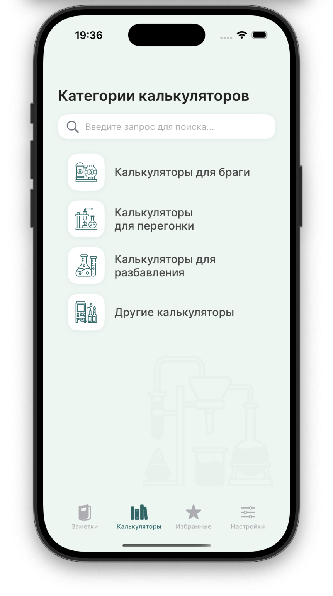
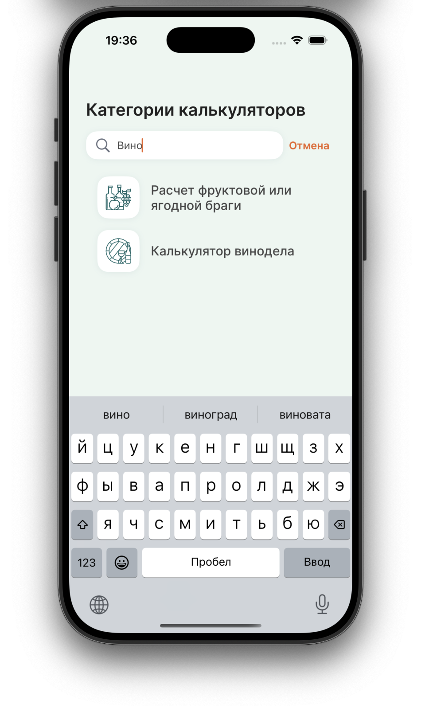
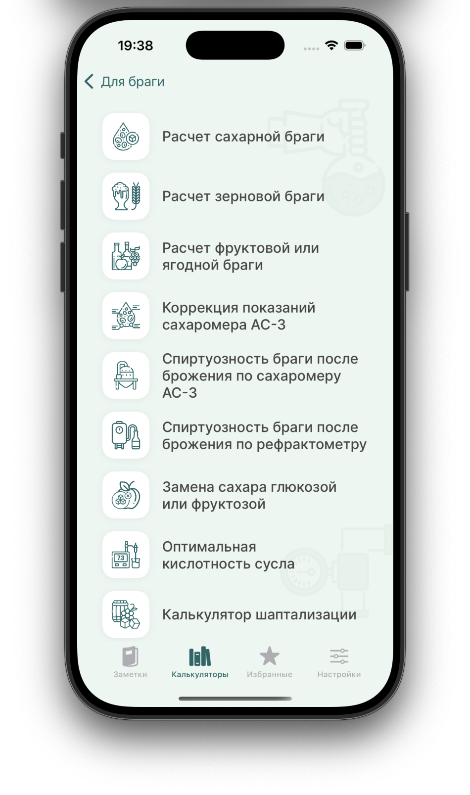
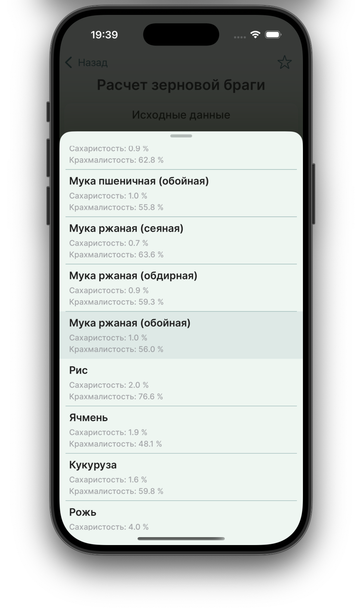
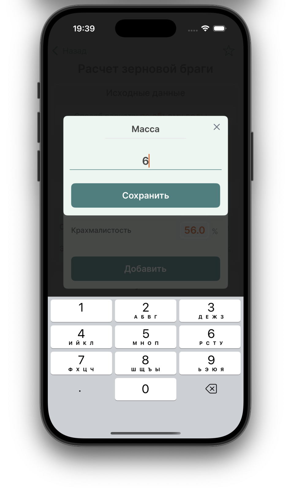
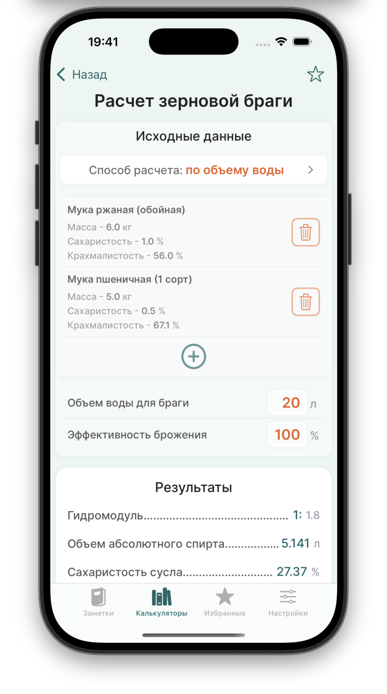
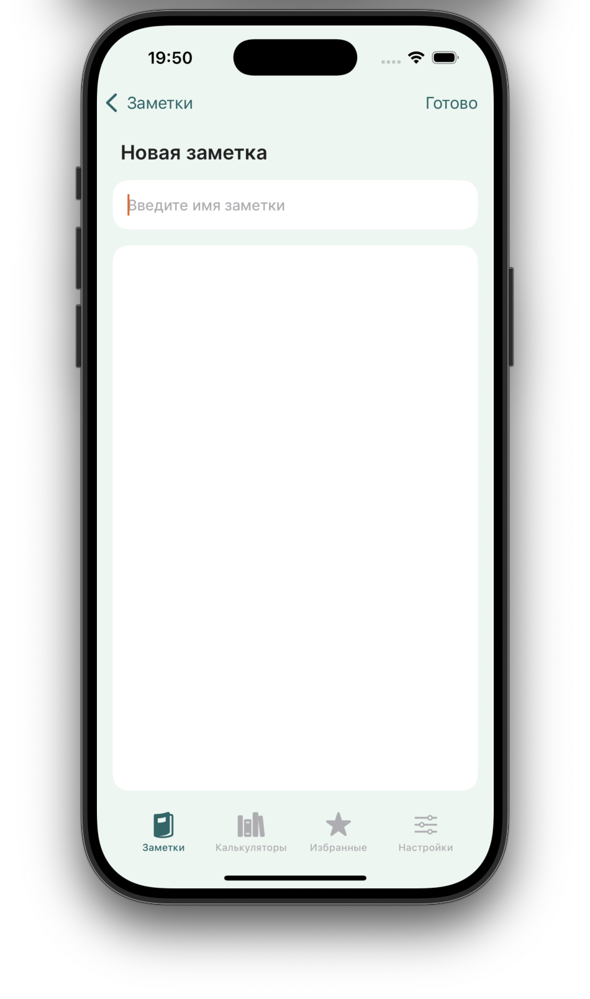
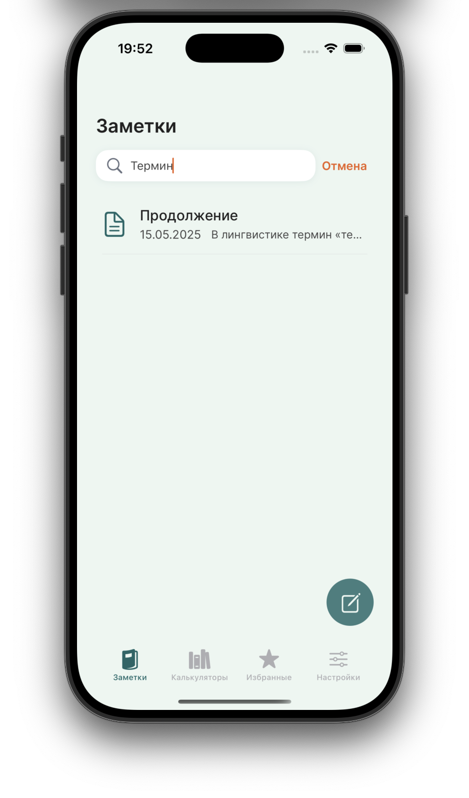

# AlcoholMixCalc

## Описание проекта

AlcoholMixCalc - это многофункциональное приложение, содержащее набор калькуляторов для различных расчетов в области смешивания жидкостей разной спиртуозности, а также для расчетов, связанных с самостоятельным производством алкогольных напитков. Приложение включает более 30 различных калькуляторов, каждый из которых предназначен для специфических расчетов, связанных с приготовлением и смешиванием алкогольных напитков.

Скачать приложение можно в AppStore по этой [ссылке.](https://itunes.apple.com/app/id6505008100)

### Основные функции:

- **Калькуляторы**: Более 30 калькуляторов для различных расчетов, связанных с производством и смешиванием алкогольных напитков.
- **Заметки**: Возможность ведения записей касательно расчетов и рецептов.
- **Интеллектуальный поиск**: Функция поиска, которая позволяет быстро находить нужные калькуляторы.
- **Избранное**: Раздел избранных калькуляторов для быстрого доступа к наиболее часто используемым инструментам.
- **Красивый дизайн**: Приложение имеет современный и привлекательный дизайн, с упором на пользовательский опыт и удобство использования.
- **Анимации**: Используются как нативные анимации, так и анимации с помощью сторонних библиотек.

## Технологии

Приложение AlcoholMixCalc разработано с использованием современных технологий и популярных паттернов программирования, обеспечивающих высокую производительность и надежность. Вот основные технологии, использованные при разработке приложения:

- **Swift**: Основной язык программирования для разработки iOS-приложений.
- **UIKit**: Библиотека, используемая для создания и управления пользовательскими интерфейсами. В приложении активно используются элементы UIKit, такие как кнопки, текстовые поля, таблицы, коллекции и другие компоненты.
- **Core Data**: Фреймворк для локального хранения данных, обеспечивающий эффективное и безопасное управление данными пользователей.
- **Lottie**: Библиотека для добавления привлекательных и интерактивных анимаций. Используется для создания плавных и высококачественных анимаций в приложении.
- **CoreXLSX**: Библиотека для работы с Excel файлами, позволяющая экспортировать и импортировать данные в формате XLSX.
- **Auto Layout**: Технология для создания адаптивных интерфейсов, которые подстраиваются под разные размеры экранов устройств.
- **Networking**: Для выполнения сетевых запросов и взаимодействия с внешними API.

### Дополнительные особенности:

- **Паттерны программирования**: Приложение написано с использованием популярных паттернов программирования, таких как MVC, MVVM, Singleton и другие, что обеспечивает чистоту и поддерживаемость кода.
- **Интеллектуальный поиск**: Функция поиска позволяет быстро находить нужные калькуляторы по ключевым словам и тегам.
- **Избранное**: Возможность добавлять калькуляторы в избранное для быстрого доступа.
- **Дизайн**: Особое внимание уделено дизайну приложения, чтобы обеспечить интуитивно понятный и приятный интерфейс. Использование цветовых схем, типографики и иконок делает приложение удобным и привлекательным.
- **Анимации**: Использование нативных анимаций UIKit и сторонних анимаций с помощью Lottie делает взаимодействие с приложением более живым и интерактивным.

AlcoholMixCalc предоставляет пользователям мощные инструменты для проведения точных расчетов, связанных с производством и смешиванием алкогольных напитков, обеспечивая при этом удобство использования и высокое качество интерфейса.

## Скриншоты

   
  
   
   
  
  
  
